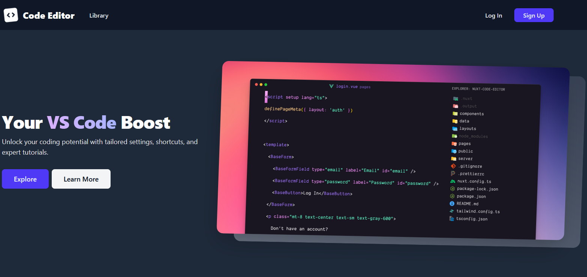
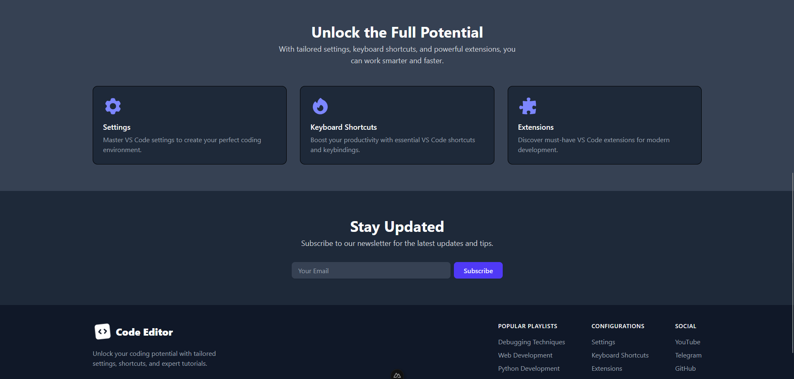
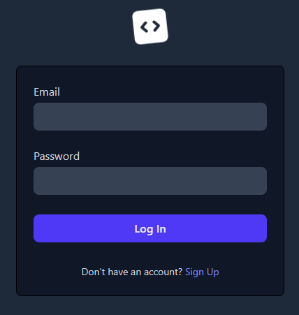
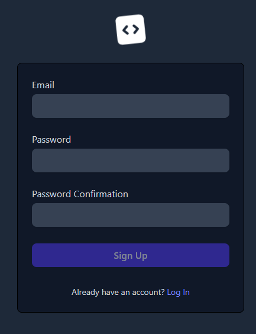
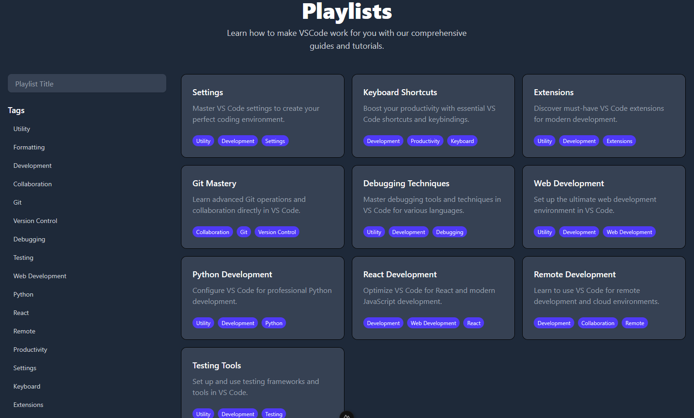
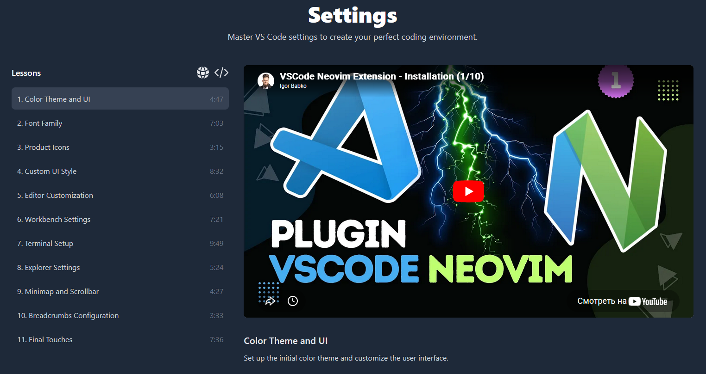

# 🎓 Code Editor / Video Learning Platform

Приложение для видеокурсов на Nuxt 3 + TypeScript. Авторизация, личные плейлисты, адаптивный интерфейс.


---

## 📸 Скриншоты

### 🏠 Главная страница




---

### 🔐 Авторизация





---

### 📚 Плейлисты


_Сетка плейлистов с фильтрацией по тегам_


_Страница конкретного плейлиста со списком уроков_

---

## 🚀 Демо

**Live Demo:** [ссылка-на-демо](#) (в разработке)

---

## 📖 Описание

Полнофункциональное веб-приложение для управления видео-контентом с:

- ✅ Регистрацией и аутентификацией пользователей
- ✅ Персональными плейлистами и библиотекой уроков
- ✅ Адаптивным дизайном (mobile-first)
- ✅ Тёмной/светлой темой
- ✅ SEO-оптимизацией и SSR

---

## ✨ Функционал

### 🔐 Аутентификация

- Регистрация с валидацией email и пароля
- Вход/выход с HttpOnly cookies
- Защищённые маршруты (middleware)
- Автоматический редирект авторизованных пользователей

### 📚 Контент

- Сетка плейлистов с фильтрацией
- Детальная страница плейлиста
- Вложенные уроки с прогрессом
- Теги и категории
- Форматирование длительности видео

### 🎨 UI/UX

- Адаптивная навигация (десктоп + мобильное меню)
- Компонентная архитектура (атомарный дизайн)
- Переиспользуемые UI-элементы
- Slugified URL для красивых ссылок

---

## 🛠 Технологический стек

### Frontend

- **Nuxt 3** — Vue 3 фреймворк с SSR
- **Vue 3** — Composition API + `<script setup>`
- **TypeScript** — полная типизация
- **Tailwind CSS** — утилитарные стили
- **Pinia/Stores** — управление состоянием

### Backend

- **Nuxt Server API** — серверные endpoints
- **Drizzle ORM** — типобезопасная работа с БД
- **SQLite** — база данных
- **nuxt-auth-utils** — сессии и аутентификация

### Инструменты

- **Git** — контроль версий
- **npm** — пакетный менеджер

---

## 📁 Структура проекта

```
├── app/
│   ├── components/           # UI-компоненты
│   │   ├── global/           # AppButton, AppInput, Header, Footer
│   │   └── feature/          # PlaylistGrid, LessonList, TagList
│   ├── layouts/              # auth.vue, default.vue
│   ├── pages/                # Маршрутизация
│   │   ├── index.vue         # Главная
│   │   ├── login.vue         # Вход
│   │   ├── register.vue      # Регистрация
│   │   └── playlists/        # Плейлисты и уроки
│   │       ├── index.vue
│   │       ├── [playlistSlug].vue
│   │       └── [playlistSlug]/lessons/[lessonSlug].vue
│   ├── stores/               # playlists.store.ts, lessons.store.ts
│   ├── interfaces/           # TypeScript типы
│   └── utils/                # slugify, formatDuration, validation
│
├── server/
│   ├── api/                  # login.post.ts, register.post.ts
│   ├── database/
│   │   ├── schema.ts         # Drizzle схема БД
│   │   └── migrations/       # Миграции
│   └── utils/
│       └── drizzle.ts        # Настройка БД
│
└── public/                   # Статические файлы
```

## 🚀 Быстрый старт

### Требования

- Node.js 22+
- npm

### Установка

```bash
# Клонируйте репозиторий
git clone https://github.com/rakhzar/code-editor.git
cd code-editor

# Установите зависимости
npm install
```
